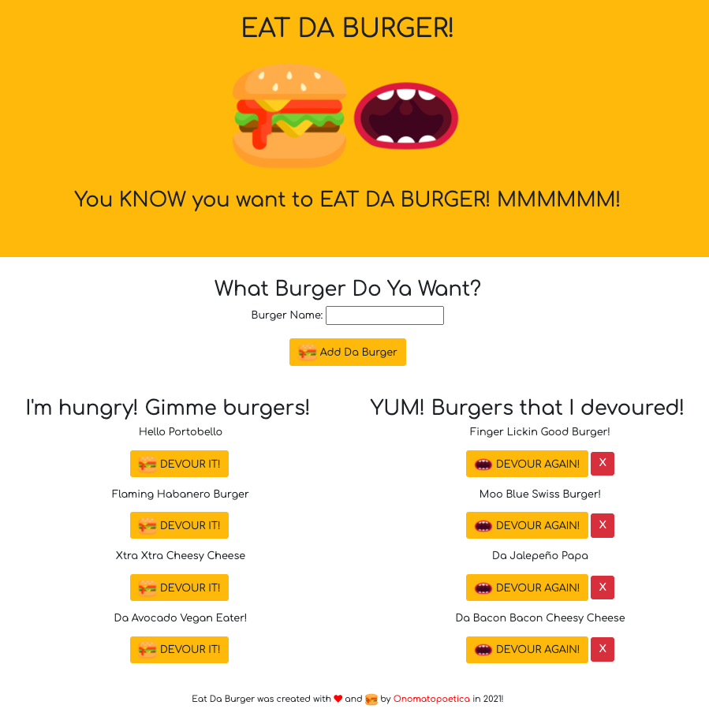

         <br> 

# Eat Da Burger
A burger logger developed using MySQL, Node, Express, Handlebars and a homemade ORM (yum!). An MVC design pattern was followed using Node and MySQL to query and route data in the app, and Handlebars to generate the HTML.

## Project Links
[Repo Link](https://github.com/onomatopoetica/eat-da-burger) <br>
**NOTE:** Since this application cannot be deployed on GitHub, the deployed app can be found on [Heroku](https://calm-anchorage-60492.herokuapp.com/). Please see the **Demo** section below for an overview of its functionality and the **Getting Started** section for more information regarding installation, usage, contribution guidelines, tests and where to go for questions.
    
## Table of Contents
1. [About The Project](#About-The-Project)
1. [Project Links](#Project-Links)
1. [Demo](#Demo)
1. [Getting Started](#Getting-Started)
1. [Installation](#Installation)
1. [Usage](#Usage)
1. [Tests](#Tests)
1. [Contribution Guidelines](#Contribution-Guidelines)
1. [Questions](#Questions)
1. [Project Status](#Project-Status)
1. [License](#License)
 
## About The Project

* Eat Da Burger is a restaurant app that allows users to input the names of burgers they would like to eat.

* Whenever a user submits a burger's name, the app will display the burger beneath an `I'm hungry! Gimme burgers!` heading of the page -- waiting to be devoured.

* Each burger in the waiting area has a `DEVOUR IT!` button. When the user clicks the button, the burger will move beneath the `YUM! Burgers that I devoured!` heading of the page.

* The user can then order another of the same burger by clicking the `DEVOURED` button (this places that burger name back in the waiting area), or delete a devoured burger by pressing the `X` button.

* The app will store every burger in the database, whether devoured or not.

Because this application cannot be deployed on GitHub, a walkthrough video demonstrates its functionality below. The deployed app can be found on [Heroku](https://calm-anchorage-60492.herokuapp.com/).

## User Story

```
As a hungry individual
I want to be able to enter and manage burgers on a menu
So that I can add, select, and subsequently devour, said burgers!
```

## Acceptance Criteria

```
GIVEN a burger logger application that allows a hungry user to input burgers they would like to devour:
WHEN I input the name of a burger I would like to devour
THEN that burger name is placed in the waiting area with a DEVOUR IT! button
WHEN I click the DEVOUR IT! button the burger is DEVOURED and placed in the DEVOURED section of the page
THEN I have the option to order another burger by clicking the DEVOURED! button
THEN the burger moves back to the waiting area with a DEVOUR IT! button
OR I can delete the burger by pressing the X button
```

## Demo

#### The following is an overview of the application in operation and rendering of the Eat Da Burger app. 
    
 

#### The following are screenshots of the application and overview of its functionality: <br>




## Getting Started
    
#### Following the MVC design pattern, languages, packages + runtime environment used in this project include:
* MySQL 
* Node.js
* Express
* Handlebars
* ORM
    
#### Installation: 
```  
git clone - https://github.com/onomatopoetica/eat-da-burger.git
```
#### Usage 
```
The application is a burger logger developed using MySQL, Node, Express, Handlebars and Object-Relational Mapping (ORM). 
An MVC design pattern was followed using Node and MySQL to query and route data in the app, and Handlebars to generate the HTML. 
See demo video above for more information on how it works.
```
#### Tests
```
After cloning the repo:

Create a server.js file. Make a package.json file by running 'npm init' from the command line.
Install the dependencies: enter command 'npm install mysql express express-handlebars'. 
The application will be invoked by using 'nodemon' or entering the following in the command line: 'node server.js'. 
The Eat Da Burger App will be rendered on or entering the following in the command line: 'node server.js'. 
You will see 'App now listening at localhost:3000' in the console. You can then view the app on http://localhost:3000/.
```    
#### Contribution Guidelines
```
When contributing to this repository, please contact the project team for review of your contribution plan. 
See contact details below.
```
## Questions 
#### Connect with the project team: [Onomatopoetica](https://github.com/onomatopoetica)
   
<details>
    <summary>Contact</summary>
    jendotb@gmail.com
</details>

## Project Status
<details>
    <summary>Current Project Activity</summary>
    Active
</details>
    
## License
#### Distributed under the MIT License. See `LICENSE` for more information.

##### This README was generated with :hearts:&nbsp; by [Good README Generator](https://github.com/onomatopoetica/Good-README-Generator).

